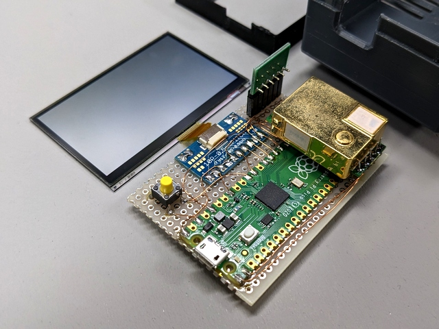
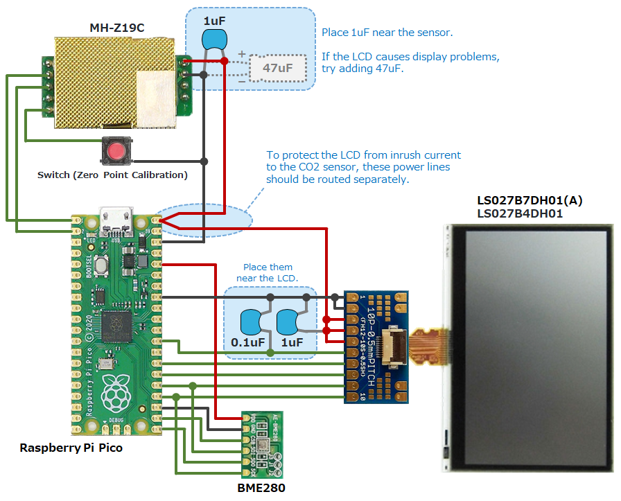

# pico-env-mon

~~秋月電子だけ~~ ネットで買える部品でできる環境モニタです。

温度、湿度、気圧、CO2濃度を 5秒間隔で取得し、24時間のトレンドグラフとともに表示します。

反射型のディスプレイなので寝室等でも眩しくありません。

----

## 作例

3Dプリンタで作ったケースに収めた例です。




----

## 使用部品

- [Raspberry Pi Pico](https://akizukidenshi.com/catalog/g/g116132/)
- LCD
    - LS027B4DH01 (動作確認済)
        - [シャープ モノクロHR-TFTメモリ液晶モジュール (LS027B4DH01)](https://akizukidenshi.com/catalog/g/g104944/) → 2024/06/29 現在売り切れ
        - [モノクロHR-TFTメモリ液晶モジュール LS027B4DH01 — スイッチサイエンス](https://www.switch-science.com/products/1607) → 2024/06/30 現在売り切れ
        - [モノクロHR-TFTメモリ液晶モジュール LS027B4DH01 【スイッチサイエンス取寄品】 / SHARP-LS027B4DH01](https://eleshop.jp/shop/g/gN1BSC7/)
    - LS027B7DH01 :warning: [同シリーズと思われます](https://x.com/pcjpnet/status/1803709680235278717) が互換性不明、動作未確認、あくまで参考です :
        - [LS027B7DH01A Sharp Microelectronics | オプトエレクトロニクス | DigiKey](https://www.digikey.jp/ja/products/detail/sharp-microelectronics/LS027B7DH01A/5054067)
        - [LS027B7DH01 Sharp Microelectronics | オプトエレクトロニクス | DigiKey](https://www.digikey.jp/ja/products/detail/sharp-microelectronics/LS027B7DH01/5054066)
    - :warning: フレキケーブルは乱暴に扱うと壊れやすいので注意してください。
- [フレキコネクタDIP化キット(AE-CNCONV-10P-0.5)](https://akizukidenshi.com/catalog/g/g107253/)
- [BME280使用　温湿度・気圧センサモジュールキット (AE-BME280)](https://akizukidenshi.com/catalog/g/g109421/)
- [CO2センサーモジュール MH-Z19C](https://akizukidenshi.com/catalog/g/g116142/)
    - :warning: ピンヘッダが付いていますが 2.54mmピッチのユニバーサル基板には適合しません。1.27mmピッチのユニバーサル基板を使用するか、ピンヘッダを使用せずに配線してください。
- [タクトスイッチ](https://akizukidenshi.com/catalog/g/g103647/)
    - CO2センサのキャリブレーションに使用します。
- セラミックコンデンサ
    - ノイズ対策のバイパスコンデンサ（パスコン）です。
    - 50V 0.1uF ([秋月電子を検索](https://akizukidenshi.com/catalog/goods/search.aspx?ct=02020101&goods_specification=0.1%CE%BCF&search=%E6%A4%9C%E7%B4%A2%E3%81%99%E3%82%8B))
        - 例: [積層セラミックコンデンサー 0.1μF50V X7R 2.54mm](https://akizukidenshi.com/catalog/g/g113582/)
    - 50V 1uF ([秋月電子を検索](https://akizukidenshi.com/catalog/goods/search.aspx?ct=02020101&goods_specification=1%CE%BCF&search=%E6%A4%9C%E7%B4%A2%E3%81%99%E3%82%8B))
        - 例: [積層セラミックコンデンサー 1μF50V X7R 5mm](https://akizukidenshi.com/catalog/g/g115874/)
- 電解コンデンサ
    - LCD に問題が生じた場合は追加します。
    - 16V 47uF ([秋月電子を検索](https://akizukidenshi.com/catalog/goods/search.aspx?ct=02020102&goods_specification=47%CE%BCF&search=%E6%A4%9C%E7%B4%A2%E3%81%99%E3%82%8B))
        - 例: [電解コンデンサー 47μF16V105℃ ルビコンPX](https://akizukidenshi.com/catalog/g/g110270/)
- [分割ロングピンソケット 1x42(42P)](https://akizukidenshi.com/catalog/g/g105779/)
- その他
    - ユニバーサル基板
        - サンプルとして公開しているケースの STL に適合させるにはカットする必要があります（後述）。
    - 配線類
    - microUSBケーブル (書き込み/電源供給)

----

## 接続

|Pico|LS027B4DH01|BME280|MH-Z19C|
|:--|:--|:--|:--|
|`VBUS`|`VDD`, `VDDA`, `EXTMODE`<br>セラミック 1uF||`Vin`<br>セラミック 1uF (+ 電解 47uF)|
|`3V3`||`VDD`||
|`GND`|`VSS`, `VSSA`|`GND`|`GND`|
|`GPIO0` (uart0 TX)|||`RX`|
|`GPIO1` (uart1 RX)|||`TX`|
|`GPIO16` (spi0 RX)||`SDO`|
|`GPIO17` (spi0 CSn)||`CSB`|
|`GPIO18` (spi0 SCLK)|`SCLK`|`SCK`|
|`GPIO19` (spi0 TX)|`SI`|`SDI`|
|`GPIO20`|`SCS`||
|`GPIO21`|`EXTCOMIN`||
|`GPIO22`|`DISP`<br>セラミック 0.1uF||



### 接続上の注意

CO2センサー MH-Z19C は内蔵された電球の駆動のために定期的に大きな電流を吸い込みます。これが LCD の動作に影響えないよう、配線の引き回しやコンデンサの配置に注意する必要があります。

- MH-Z19C と LCD の電源ラインは根元から別々に配線してください。
- MH-Z19C と LCD それぞれの直近にセラミックコンデンサを実装してください。
- これでも LCD の表示に問題が生じた場合は MH-Z19C の直近に電解コンデンサ 47uF を追加してみてください。

----

## プログラム

### バイナリ

1. [Releases](https://github.com/shapoco/pico-env-mon/releases) から `pico_env_mon_x.x.zip` をダウンロードし、展開します。
2. Raspberry Pi Pico の `BOOT SEL`ボタンを押しながら USBケーブルを接続し、書き込みモードにします (USBストレージとして認識されます)。
3. `pico_env_mon.uf2` を Raspberry Pi Pico に書き込みます。

### ソースコードからのビルド

ビルドするには Raspberry Pi Pico SDK が必要です。インストール方法はググってください。Windows の場合は WSL2上にインストールすることをお勧めします。

1. 本リポジトリを clone し、リポジトリのディレクトリ内でビルドを実行します。

    ```sh
    git clone https://github.com/shapoco/pico-env-mon.git
    cd pico-env-mon
    mkdir build
    cd build
    cmake ..
    make
    ```

3. Raspberry Pi Pico の `BOOT SEL`ボタンを押しながら USBケーブルを接続し、書き込みモードにします (USBストレージとして認識されます)。
4. `pico-env-mon/build/pico_env_mon.uf2` を Raspberry Pi Pico に書き込みます。

----

## ケースの STL について

[ケース用の STL のサンプル](stl/) を公開しています。2.54mm ピッチのユニバーサル基板を 24穴 x 17穴 にカットし、以下のようにレイアウトする前提の形状になっています。 基板を搭載する部分の内寸は 66 x 48mm です。


----

## 調整

### BME280 の温度

BME280 で取得できる温度の値は湿度と気圧の補正のためのもので、実際の気温より若干高くなります。

> The integrated temperature sensor has been optimized for lowest noise and highest resolution. Its output is used for temperature compensation of the pressure and humidity sensors and can also be used for estimation of the ambient temperature. 

> Temperature measured by the internal temperature sensor. This temperature value depends on the PCB temperature, sensor element self-heating and ambient temperature and is typically above ambient temperature.

実際の気温とどの程度乖離するかはセンサの使用条件によります。ケースに入れたり、BME280 を CO2センサに近接させたりすると乖離が大きくなります。本プロジェクトではこれらを考慮し、デフォルトでは取得した温度から 1.5℃ 減算した値を表示します。

補正値を変更するには、`src/pico_env_mon.cpp` の次の箇所を変更してビルドし直してください。

```c++
static const float TEMPERATURE_OFFSET = -1.5f;
```

### MH-Z19C のキャリブレーション

MH-Z19C は初期状態では正しい値を示さないケースがあるようです。

屋外に放置して値が 400ppm 付近まで下がらない場合や、人がいる室内なのに 400ppm 付近に張り付いてしまう場合はキャリブレーションを実施してください。

参考 : [Home Assistant: ESP32+MH-Z19CでCO2モニター構築(2) [キャリブレーション編] - Sympapaのスマートホーム日記](https://sympapa.hatenablog.com/entry/2022/06/05/091621)

1. 本機を屋外や誰もいない風通しの良い場所に 20分間放置します。
2. 吐息がかからないように息を止めて、Zero Point Calibrationスイッチを 7秒間押下します。

なお、本プロジェクトではオートキャリブレーションは無効化されています。

### 時間軸のスケール変更

デフォルトでは 24時間分のグラフが表示されます。

スケールを変更するには、`src/pico_env_mon.cpp` の次の箇所を変更してビルドし直してください。

```c++
static const int GRAPH_TIME_RANGE_H = 24;
```

----
